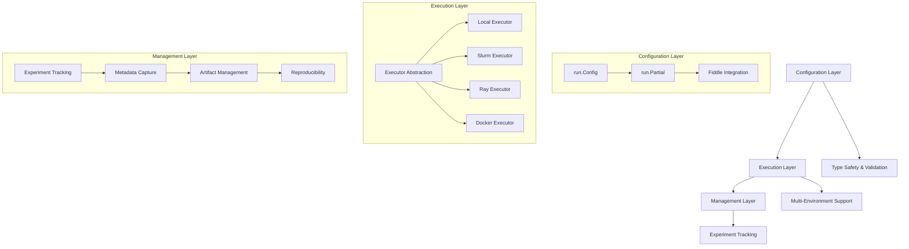

(architecture-overview)=

# Architecture Overview

NeMo Run's architecture is designed around three core principles: **separation of concerns**, **extensibility**, and **type safety**. The framework provides a unified interface for ML experiment lifecycle management while maintaining flexibility across diverse computing environments.

## System Overview

NeMo Run follows a modular architecture that separates configuration, execution, and management concerns:



## Core Components

### Configuration Layer

The configuration layer provides type-safe, serializable configuration management:

#### **run.Config**
- **Purpose**: Main configuration container with type validation
- **Features**:
  - Automatic type checking using Python annotations
  - Serialization to/from YAML/JSON
  - Nested configuration support
  - Runtime validation and error reporting

#### **run.Partial**
- **Purpose**: Partial configuration for incremental updates
- **Features**:
  - Selective parameter overrides
  - Configuration composition
  - Dynamic parameter injection
  - Template-based configurations

#### **Fiddle Integration**
- **Purpose**: Robust configuration framework foundation
- **Features**:
  - Google's battle-tested configuration system
  - Advanced validation and error handling
  - Configuration visualization and debugging
  - IDE support with autocomplete

### Execution Layer

The execution layer abstracts environment-specific details behind a unified interface:

#### **Executor Abstraction**
- **Purpose**: Environment-agnostic task execution
- **Features**:
  - Plugin-based architecture for new environments
  - Consistent API across all backends
  - Automatic resource management
  - Fault tolerance and retry logic

#### **Supported Environments**
- **Local**: Direct execution on the current machine
- **Docker**: Containerized execution with isolation
- **Slurm**: High-performance computing clusters
- **Ray**: Distributed computing framework
- **Kubernetes**: Container orchestration
- **Cloud Platforms**: AWS, GCP, Azure integration

#### **Code Packaging**
- **Purpose**: Reproducible code deployment
- **Strategies**:
  - **Git Archive**: Version-controlled code packaging
  - **Pattern-based**: Selective file inclusion
  - **Hybrid**: Combined approach for complex projects

### Management Layer

The management layer handles experiment lifecycle and tracking:

#### **Experiment Tracking**
- **Purpose**: Comprehensive experiment metadata capture
- **Features**:
  - Automatic configuration snapshots
  - Execution environment details
  - Resource utilization metrics
  - Performance monitoring

#### **Metadata Management**
- **Purpose**: Reproducible experiment reconstruction
- **Features**:
  - Configuration versioning
  - Dependency tracking
  - Artifact linking
  - Cross-reference support

#### **Artifact Management**
- **Purpose**: Comprehensive output collection
- **Features**:
  - Automatic artifact discovery
  - Storage optimization
  - Retrieval and analysis tools
  - Version control integration

## Data Flow

### Configuration → Execution → Management

1. **Configuration Phase**
   - User defines experiment parameters using `run.Config`
   - System validates configuration against type annotations
   - Configuration is serialized for distribution

2. **Execution Phase**
   - System packages code according to selected strategy
   - Executor deploys to target environment
   - Task runs with provided configuration
   - Real-time status monitoring

3. **Management Phase**
   - System captures execution metadata
   - Artifacts are collected and stored
   - Experiment results are indexed
   - Reproducibility information is preserved

## Extension Points

### Custom Executors
```python
from nemo_run.core.execution import BaseExecutor

class CustomExecutor(BaseExecutor):
    def submit(self, task, config):
        # Custom execution logic
        pass

    def status(self, task_id):
        # Custom status checking
        pass
```

### Custom Configurations
```python
from nemo_run import Config

class MyExperimentConfig(Config):
    model_name: str
    learning_rate: float
    batch_size: int

    def validate(self):
        # Custom validation logic
        pass
```

### Custom Artifact Collectors
```python
from nemo_run.core.management import ArtifactCollector

class CustomCollector(ArtifactCollector):
    def collect(self, experiment_id):
        # Custom artifact collection
        pass
```

## Performance Considerations

### **Configuration Validation**
- Type checking happens at configuration time
- Validation errors are caught early
- IDE support provides real-time feedback

### **Execution Optimization**
- Intelligent code packaging reduces transfer overhead
- Parallel execution support for multiple tasks
- Resource pooling and reuse

### **Management Efficiency**
- Incremental metadata updates
- Lazy artifact loading
- Caching for frequently accessed data

## Security and Isolation

### **Environment Isolation**
- Container-based execution provides process isolation
- Resource limits prevent resource exhaustion
- Network isolation for sensitive experiments

### **Configuration Security**
- Type validation prevents injection attacks
- Serialization validation ensures data integrity
- Access control for sensitive configurations

## Integration Points

### **CI/CD Integration**
- Configuration-driven deployment pipelines
- Automated testing with NeMo Run
- Continuous experiment monitoring

### **ML Framework Integration**
- PyTorch, TensorFlow, and other framework support
- Custom launcher integration
- Framework-specific optimizations

### **Monitoring and Observability**
- Integration with existing monitoring systems
- Custom metrics collection
- Alert and notification systems

## Best Practices

### **Configuration Design**
- Use type annotations for all parameters
- Implement custom validation where needed
- Keep configurations modular and reusable

### **Execution Strategy**
- Choose appropriate packaging strategy for your use case
- Consider environment-specific optimizations
- Plan for scalability from the start

### **Management Workflow**
- Establish consistent naming conventions
- Implement proper artifact organization
- Regular cleanup of old experiments

## Future Architecture Directions

### **Planned Enhancements**
- Enhanced distributed execution capabilities
- Advanced workflow orchestration
- Improved visualization and debugging tools
- Extended cloud platform support

### **Community Contributions**
- Plugin ecosystem for custom extensions
- Community-driven executor implementations
- Shared configuration templates and patterns

The architecture is designed to evolve with the needs of the ML community while maintaining the core principles of type safety, extensibility, and separation of concerns.
