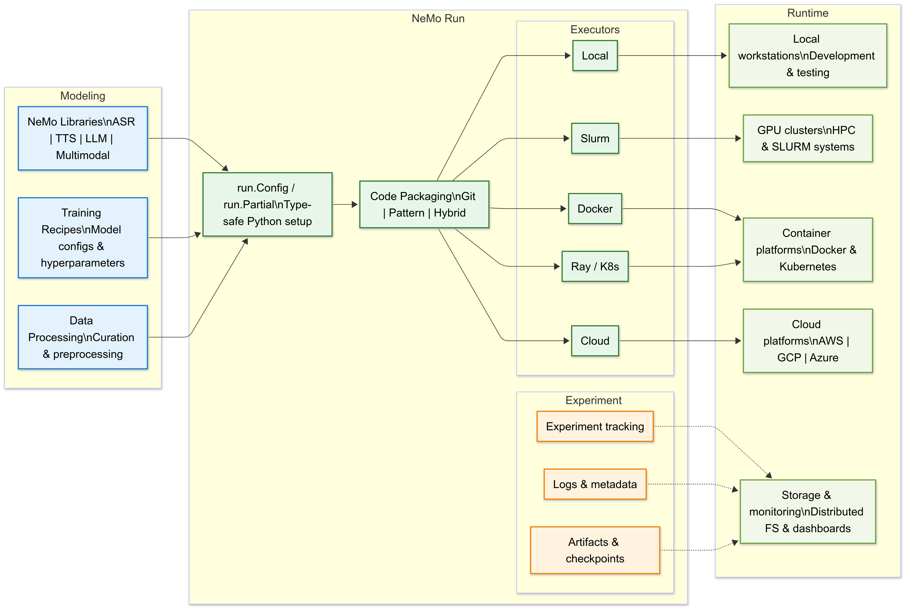

# NeMo Run and the NeMo Ecosystem

The **NeMo ecosystem** is NVIDIA's comprehensive platform for AI model development, spanning from research to production. **NeMo Run** serves as the crucial orchestration layer that bridges model development with scalable execution across diverse computing environments.

## NeMo Run: The Orchestration Framework

**NeMo Run** is a separate orchestration framework that works alongside the NeMo Framework and Libraries. It serves as the crucial bridge between model development and scalable execution, handling all the operational complexities of running AI experiments at scale.

### Core Capabilities

NeMo Run provides four essential orchestration capabilities:

- **Experiment Configuration**: Type-safe, Python-based setup and parameter management that replaces complex YAML files
- **Multi-Environment Execution**: Seamless deployment across local, cluster, and cloud environments without code changes
- **Lifecycle Management**: Comprehensive tracking, logging, and reproducibility features for experiment management
- **Resource Orchestration**: Intelligent packaging, submission, and monitoring of training jobs across diverse infrastructure

### How NeMo Run Integrates with NeMo Components

NeMo Run bridges the gap between model development (NeMo Framework/libraries) and scalable execution across diverse computing environments. **NeMo libraries focus on what to run, while NeMo Run focuses on how to run**—together they provide an end-to-end path from model code to scalable, production-ready execution.

**The Integration Model:**

NeMo Run acts as the "conductor" that takes your model code from NeMo Libraries and makes it runnable at scale. Here's how the integration works:

1. **Model Development**: Use NeMo Libraries (ASR, TTS, LLM, etc.) to define your model architecture and training logic
2. **Configuration**: Use NeMo Run's Python-based configuration system to define experiment parameters and execution requirements
3. **Orchestration**: NeMo Run packages your code, manages dependencies, and handles environment setup
4. **Execution**: Deploy seamlessly across local machines, SLURM clusters, Kubernetes, or cloud platforms
5. **Management**: Track experiments, collect artifacts, and ensure reproducibility across all environments

## NeMo Run's Architecture and Integration

NeMo Run provides the operational bridge from modeling to execution. This section shows how configuration, packaging, and executors turn NeMo library recipes into scalable runs across local machines, clusters, and cloud—while capturing logs, checkpoints, and metadata for reproducibility.

### 1. Modeling Layer (NeMo Framework & Libraries)

- **NeMo Libraries**: Specialized components for speech, language, and multimodal AI
- **Model Implementations**: Pre-built architectures for large language models, ASR, TTS, and multimodal models
- **Training Recipes**: Complete configurations defining model architectures, hyperparameters, and training procedures
- **Data Processing**: Utilities for data curation, tokenization, and preprocessing
- **Output**: Python functions and configurations that define "what to train"

### 2. Orchestration Layer (NeMo Run)

- **Configuration**: `run.Config` / `run.Partial` for type-safe, Python-based experiment setup
- **Packaging**: Intelligent code packaging strategies (git/pattern/hybrid) for reproducible deployments
- **Executors**: Backend-agnostic execution support (Local, Docker, SLURM, Ray, Kubernetes, cloud platforms)
- **Management**: Automated capture of logs, metadata, checkpoints, and artifacts for reproducibility
- **Purpose**: Defines "how to run" experiments across diverse computing environments

### 3. Runtime/Infrastructure Layer

- **Compute Resources**: Local workstations, GPU clusters, HPC systems (SLURM), cloud platforms (AWS, GCP, Azure)
- **Container Platforms**: Docker environments, Kubernetes clusters, managed cloud services
- **Storage Systems**: Distributed file systems, object storage, checkpoint repositories
- **Monitoring & Observability**: Metrics collection, log aggregation, experiment tracking dashboards
- **Resource Management**: Auto scaling, quota management, environment isolation, and cost optimization

*Click the diagram to view it in full size*

