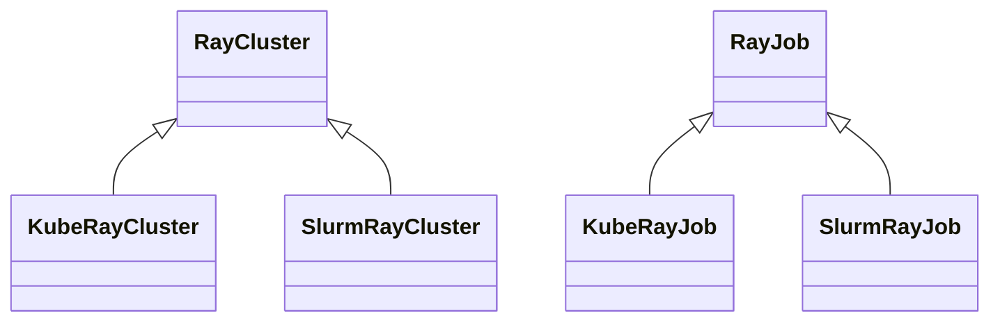

# Deploy Ray Clusters and Jobs

> **Audience**: You already know how to configure executors with NeMo Run and want distributed Ray on either Kubernetes or Slurm.
>
> **TL;DR**: `RayCluster` manages the cluster; `RayJob` submits a job with an ephemeral cluster. Everything else is convenience wrappers.

## Choose RayCluster or RayJob

| Aspect | RayCluster (interactive) | RayJob (batch) |
|--------|--------------------------|----------------|
| Cluster lifetime | Remains until you call `.stop()` | Ephemeral—cluster automatically deletes after the job finishes |
| Spin-up cost per run | Paid once (reuse for multiple jobs) | Paid per submission |
| Multiple jobs on same cluster | Yes | No (one job per submission) |
| Dashboard access | `.port_forward()` to open | Not exposed by default |
| Best for | Debugging, notebooks, iterative development, sweeps that reuse workers | CI/CD, scheduled training/evaluation, single runs |
| Resource efficiency | Effective when you launch multiple jobs interactively | Effective when you need automatic cleanup |

### Mental Model

| Object | What it abstracts | Backends supported |
|--------|-------------------|--------------------|
| `nemo_run.run.ray.cluster.RayCluster` | Lifecycle of a Ray cluster (create ⇒ wait ⇢ status ⇢ port-forward ⇢ delete) | `KubeRayExecutor`, `SlurmExecutor` |
| `nemo_run.run.ray.job.RayJob` | Lifecycle of a Ray job (submit ⇒ monitor ⇢ logs ⇢ cancel) | same |

The two helpers share a uniform API; the selected executor determines whether NeMo Run uses the Ray operator for Kubernetes or a Slurm job under the hood.



## Kubernetes Quick Start

```python
from nemo_run.core.execution.kuberay import KubeRayExecutor, KubeRayWorkerGroup
from nemo_run.run.ray.cluster import RayCluster
from nemo_run.run.ray.job import RayJob

# 1) Configure a KubeRay executor (resources + cluster policy)
executor = KubeRayExecutor(
    namespace="ml-team",
    ray_version="2.43.0",
    image="anyscale/ray:2.43.0-py312-cu125",
    head_cpu="4",
    head_memory="12Gi",
    worker_groups=[
        KubeRayWorkerGroup(
            group_name="worker",
            replicas=2,
            gpus_per_worker=8,
            # Optionally request CPU/memory for workers
            cpu_requests="16",
            memory_requests="64Gi",
        )
    ],
    # Optional tweaks ----------------------------------------------------
    reuse_volumes_in_worker_groups=True,
    spec_kwargs={"schedulerName": "runai-scheduler"},
    volume_mounts=[{"name": "workspace", "mountPath": "/workspace"}],
    volumes=[{
        "name": "workspace",
        "persistentVolumeClaim": {"claimName": "ml-workspace-pvc"},
    }],
    env_vars={
        "UV_PROJECT_ENVIRONMENT": "/home/ray/venvs/driver",
        "NEMO_RUN_VENV_DIR": "/home/ray/venvs",
        "HF_HOME": "/workspace/hf_cache",
    },
    container_kwargs={
        "securityContext": {
            "allowPrivilegeEscalation": False,
            "runAsUser": 1000,
            "runAsGroup": 1000,
            "fsGroup": 1000,
        }
    },
)

# 2) Commands executed in EVERY Ray container before the daemon starts
pre_ray_start = [
    "pip install uv",
    "echo 'unset RAY_RUNTIME_ENV_HOOK' >> /home/ray/.bashrc",
]

# 3) Spin up the cluster and expose the dashboard
cluster = RayCluster(name="demo-kuberay-cluster", executor=executor)
cluster.start(timeout=900, wait_until_ready=True, pre_ray_start_commands=pre_ray_start)
cluster.port_forward(port=8265, target_port=8265, wait=False)  # http://localhost:8265

# 4) Submit a Ray Job that runs inside that cluster
job = RayJob(name="demo-kuberay-job", executor=executor)
job.start(
    command="uv run python examples/train.py --config cfgs/train.yaml",
    workdir="/workspace/project/",  # synchronized to persistent storage
    runtime_env_yaml="/workspace/project/runtime_env.yaml",  # optional
    pre_ray_start_commands=pre_ray_start,
)
job.logs(follow=True)  # or: job.logs(lines=200)

# 5) Clean up
cluster.stop()
```

Notes:

- **Working directory synchronization**: When you set `workdir`, NeMo Run synchronizes your local files to the first `volume_mounts` entry and sets the container working directory accordingly.
- **Pre-start commands**: `pre_ray_start_commands=[...]` run in head and worker containers before Ray starts (injected via lifecycle hooks).

## Slurm Quick Start

```python
import nemo_run as run
from nemo_run.core.execution.slurm import SlurmExecutor, SlurmJobDetails, SSHTunnel
from nemo_run.run.ray.cluster import RayCluster
from nemo_run.run.ray.job import RayJob

# 1) SSH tunnel to the Slurm login node so we can launch remotely
ssh = SSHTunnel(
    host="login.my-hpc.com",
    user="jdoe",
    job_dir="/scratch/jdoe/runs",
    identity="~/.ssh/id_ed25519",
)

# 2) Create a Slurm executor and tweak defaults
executor = SlurmExecutor(
    account="gpu-dept",
    partition="a100",
    nodes=2,
    gpus_per_node=8,
    gres="gpu:8",
    time="04:00:00",
    container_image="nvcr.io/nvidia/pytorch:24.05-py3",
    container_mounts=["/scratch:/scratch"],
    env_vars={"HF_HOME": "/scratch/hf_cache"},
    tunnel=ssh,
)

# Optional: customize where Slurm writes stdout/err
class CustomJobDetails(SlurmJobDetails):
    @property
    def stdout(self):
        from pathlib import Path
        assert self.folder
        return Path(self.folder) / "sbatch_stdout.out"

    @property
    def stderr(self):
        from pathlib import Path
        assert self.folder
        return Path(self.folder) / "sbatch_stderr.err"

executor.job_details = CustomJobDetails()

# 3) Bring up the Ray cluster (Slurm array job under the hood)
pre_ray_start = ["pip install uv"]
cluster = RayCluster(name="demo-slurm-ray", executor=executor)
cluster.start(timeout=1800, wait_until_ready=True, pre_ray_start_commands=pre_ray_start)
cluster.port_forward(port=8265, target_port=8265)  # http://localhost:8265

# 4) Submit a Ray job that runs inside the cluster
job = RayJob(name="demo-slurm-job", executor=executor)
job.start(
    command="uv run python train.py --config cfgs/train.yaml",
    workdir="/scratch/jdoe/project/",   # synchronized or packaged automatically
    pre_ray_start_commands=pre_ray_start,
)
job.logs(follow=True)

# 5) Tear everything down (or let the wall time expire)
cluster.stop()
```

## Tips for Slurm Users

- Set `executor.packager = run.GitArchivePackager()` to package a Git tree instead of file synchronization.
- Use `cluster.port_forward()` to open an SSH tunnel from your laptop to the Ray dashboard running on the head node.

## Reference: Ray Cluster and Job Interfaces

```python
from nemo_run.run.ray.cluster import RayCluster
from nemo_run.run.ray.job import RayJob

# Cluster lifecycle
cluster = RayCluster(name="my-cluster", executor=executor)
cluster.start(wait_until_ready=True, timeout=600, pre_ray_start_commands=["pip install -r …"])
cluster.status(display=True)
cluster.port_forward(port=8265, target_port=8265, wait=False)
cluster.stop()

# Job lifecycle
job = RayJob(name="my-job", executor=executor)
job.start(command, workdir, runtime_env_yaml=None, pre_ray_start_commands=None)
job.status(display=True)
job.logs(follow=True, lines=200)
job.stop()
```

## Build a Command-Line Tool

```python
import argparse
from nemo_run.core.execution.kuberay import KubeRayExecutor, KubeRayWorkerGroup
from nemo_run.run.ray.cluster import RayCluster
from nemo_run.run.ray.job import RayJob

def main() -> None:
    parser = argparse.ArgumentParser(description="Submit a Ray job via NeMo Run")
    parser.add_argument("--name", default="demo", help="Base name for cluster + job")
    parser.add_argument("--image", default="anyscale/ray:2.43.0-py312-cu125")
    parser.add_argument("--command", default="python script.py")
    args = parser.parse_args()

    executor = KubeRayExecutor(
        namespace="ml-team",
        ray_version="2.43.0",
        image=args.image,
        worker_groups=[KubeRayWorkerGroup(group_name="worker", replicas=1, gpus_per_worker=8)],
    )

    cluster = RayCluster(name=f"{args.name}-cluster", executor=executor)
    cluster.start()

    job = RayJob(name=f"{args.name}-job", executor=executor)
    job.start(command=args.command, workdir="./")
    job.logs(follow=True)

    cluster.stop()

if __name__ == "__main__":
    main()
```

---

The examples in this guide align with the current codebase:

- `KubeRayExecutor` supports `head_cpu`, `head_memory`, `worker_groups` with `KubeRayWorkerGroup` (fields like `replicas`, `gpus_per_worker`, `cpu_requests`, `memory_requests`).
- `RayCluster.start(wait_until_ready=True, timeout=..., pre_ray_start_commands=...)` and `.port_forward(port, target_port, wait)` are available.
- `RayJob.logs(follow=True, lines=...)` is the correct signature (not `tail=`).
