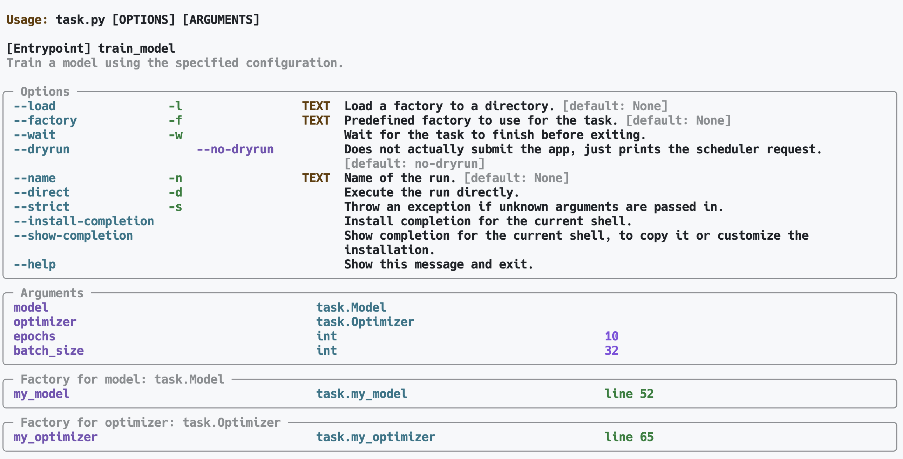

# NeMo Run CLI Entrypoints Example

This example demonstrates how to use NeMo Run to create CLI entrypoints for both individual tasks
and sequential experiments. We'll cover two main scenarios: a single task entrypoint and a
sequential experiment entrypoint.

## Single Task Entrypoint

In the `task.py` file, we define a single task entrypoint for training a model. Here's an overview
of the key components:

1. **Model and Optimizer configs**: We define `Model` and `Optimizer` dataclasses to represent our
   configurations.

2. **Main entrypoint**: The `train_model` function is decorated with `@run.cli.entrypoint`, making
   it accessible via the command line.

3. **Factory functions**: We define `my_model` and `my_optimizer` factory functions to create instances of our configuration classes. This allows us to reference these in the CLI.

```python
@run.cli.entrypoint
def train_model(
    model: Model,
    optimizer: Optimizer,
    epochs: int = 10,
    batch_size: int = 32
):
    ...

@run.cli.factory
def my_model(
    hidden_size: int = 256,
    num_layers: int = 3,
    activation: str = 'relu'
) -> Model:
    return Model(hidden_size, num_layers, activation)

@run.cli.factory
def my_optimizer(
    learning_rate: float = 0.001,
    weight_decay: float = 1e-5,
    betas: List[float] = [0.9, 0.999]
) -> Optimizer:
    return Optimizer(learning_rate, weight_decay, betas)

if __name__ == "__main__":
    run.cli.main(train_model)
```

If we now run: `python task.py --help`, we will see the following output:



We can now trigger the script with many different configurations. For example:
- `python task.py model=my_model optimizer=my_optimizer model.hidden_size=100`
- `python task.py model=my_model optimizer=my_optimizer model.hidden_size*=5`
- `python task.py model=my_model(activation="tanh") optimizer=my_optimizer`


## Sequential Experiment Entrypoint

In the `experiment.py` file, we define a sequential experiment entrypoint that trains and evaluates
a model. Here's an overview of the key components:

1. **Model and Optimizer configs**: We reuse the same `Model` and `Optimizer` dataclasses.

2. **Main entrypoint**: The `train_and_evaluate` function is decorated with
   `@run.cli.entrypoint(type="sequential_experiment")`, making it accessible via the command line.

3. **Reused train_model function**: We reuse the `train_model` function from the single task
   example for both training and evaluation.

```python
@run.cli.entrypoint(type="sequential_experiment")
def train_and_evaluate(
    experiment: run.Experiment,
    executor: run.Executor,
    model: Model,
    optimizer: Optimizer,
    train_epochs: int = 10,
    eval_epochs: int = 2
):
    """
    Run a sequential experiment to train and evaluate a model.

    Args:
        experiment (run.Experiment): The experiment object.
        executor (run.Executor): The executor for running tasks.
        model (Model): Configuration for the model.
        optimizer (Optimizer): Configuration for the optimizer.
        train_epochs (int, optional): Number of training epochs. Defaults to 10.
        eval_epochs (int, optional): Number of evaluation epochs. Defaults to 2.
    """
    # Add tasks to the experiment
    experiment.add(
        train_model,
        executor=executor,
        name="train",
        model=model,
        optimizer=optimizer,
        epochs=train_epochs
    )

    experiment.add(
        train_model,
        executor=executor,
        name="evaluate",
        model=model,
        optimizer=optimizer,
        epochs=eval_epochs
    )

    return experiment

if __name__ == "__main__":
    run.cli.main(train_and_evaluate)
```

## Running the Entrypoints

To run the single task entrypoint, you can use various configurations. Here are some examples:

1. Basic configuration:
```
python experiment.py model=my_model optimizer=my_optimizer
```

2. Modifying a specific parameter:
```
python experiment.py model=my_model optimizer=my_optimizer model.hidden_size=100
```

3. Scaling a parameter:
```
python experiment.py model=my_model optimizer=my_optimizer model.hidden_size*=5
```

4. Specifying a parameter directly in the factory function call:
```
python experiment.py model=my_model(activation="tanh") optimizer=my_optimizer
```
