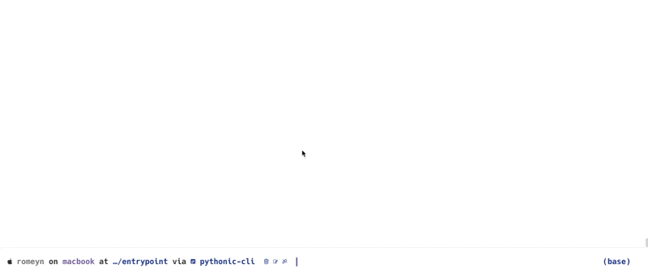
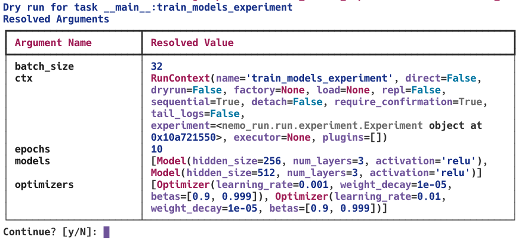
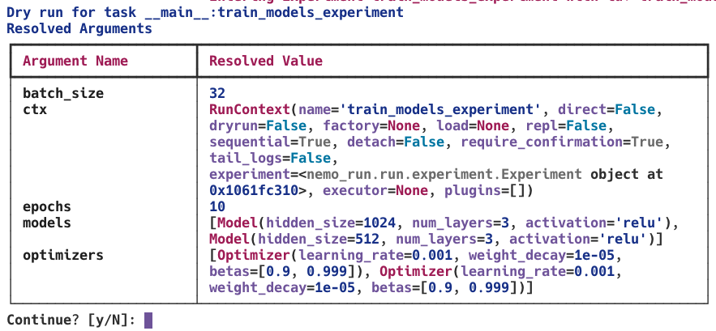
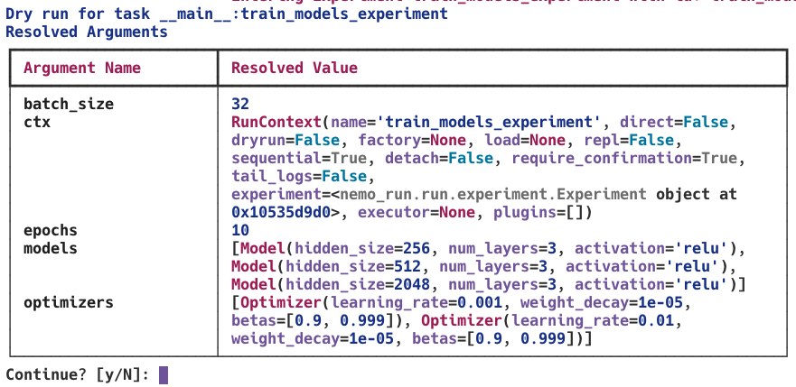

# NeMo Run CLI Entrypoints Tutorial

## Introduction

NeMo Run provides a powerful and pythonic Command-Line Interface (CLI) system that allows you to create entrypoints for both individual tasks and sequential experiments. This tutorial will guide you through the process of creating and using CLI entrypoints, demonstrating how to leverage NeMo Run's features to streamline your machine learning workflows.

## Key Concepts

Before diving into the examples, let's familiarize ourselves with some key concepts:

1. **Entrypoints**: Functions decorated with `@run.cli.entrypoint` that serve as the main entry point for your CLI commands.
2. **Factories**: Functions decorated with `@run.cli.factory` that create and configure objects used in your entrypoints. They are registered for specific types and provide a way to create complex objects with default or customized configurations. (See [Step 2](#step-2-create-factory-functions) for more details)
3. **Partials**: Partially configured functions that allow for flexible argument passing and configuration.
4. **Experiments**: A collection of tasks that can be executed sequentially or in parallel.
5. **RunContext**: An object that manages the execution context for experiments, including executor and plugin configurations.

## Single Task Entrypoint

Let's start by creating a simple task entrypoint for training a model.

```python
from dataclasses import dataclass
from typing import List

@dataclass
class Model:
    """Dummy model config"""
    hidden_size: int
    num_layers: int
    activation: str

@dataclass
class Optimizer:
    """Dummy optimizer config"""
    learning_rate: float
    weight_decay: float
    betas: List[float]
```

### Step 2: Create Factory Functions

Next, we'll create factory functions to generate instances of our configuration classes. We'll demonstrate two approaches: one using the `@run.autoconvert` decorator, and one without.

Here's an example of how to create and use factories:

```python
import nemo_run as run

@run.cli.factory
@run.autoconvert
def my_model(
    hidden_size: int = 256,
    num_layers: int = 3,
    activation: str = 'relu'
) -> Model:
    """Create a model configuration."""
    return Model(hidden_size=hidden_size, num_layers=num_layers, activation=activation)

@run.cli.factory
def my_optimizer(
    learning_rate: float = 0.001,
    weight_decay: float = 1e-5,
    betas: List[float] = [0.9, 0.999]
) -> run.Config[Optimizer]:
    """Create an optimizer configuration."""
    return run.Config(Optimizer, learning_rate=learning_rate, weight_decay=weight_decay, betas=betas)
```

In this example, we've created two factory functions: `my_model` and `my_optimizer`. Let's break down the two approaches:

1. Using `@run.autoconvert` (my_model):
   - The function is decorated with both `@run.cli.factory` and `@run.autoconvert`.
   - The function returns a regular `Model` instance.
   - `@run.autoconvert` automatically converts the return value to a `run.Config` object.
   - This approach is more concise and allows you to write the function as if you were creating a regular instance.

2. Without `@run.autoconvert` (my_optimizer):
   - The function is only decorated with `@run.cli.factory`.
   - The function explicitly returns a `run.Config[Optimizer]` object.
   - You have more control over the creation of the `run.Config` object, but it requires more explicit code.

Both approaches achieve the same result: they create factory functions that return `run.Config` objects. The choice between them depends on your preference and specific use case:

- Use `@run.autoconvert` when you want to write your factory function in a more natural style, especially for complex objects.
- Use the explicit `run.Config` approach when you need more control over the configuration process or when you're dealing with more complex configuration scenarios.

Key points about factories:
- They are registered for a specific type (e.g., Model, Optimizer) using `@run.cli.factory`.
- They can have default values and accept custom parameters.
- They return a `run.Config` object, which is then used to create the actual instance.
- Multiple factories can be registered for the same type, allowing for different configuration presets.

These factory functions can now be used in our entrypoint function to provide default configurations, which can be overridden via CLI arguments.

### Step 3: Define the task

Now, let's create our main entrypoint for training the model:

```python
@run.cli.entrypoint
def train_model(
    model: Model = my_model(),
    optimizer: Optimizer = my_optimizer(),
    epochs: int = 10,
    batch_size: int = 32
):
    """
    Train a model using the specified configuration.

    Args:
        model (Model): Configuration for the model.
        optimizer (Optimizer): Configuration for the optimizer.
        epochs (int, optional): Number of training epochs. Defaults to 10.
        batch_size (int, optional): Batch size for training. Defaults to 32.
    """
    print(f"Training model with the following configuration:")
    print(f"Model: {model}")
    print(f"Optimizer: {optimizer}")
    print(f"Epochs: {epochs}")
    print(f"Batch size: {batch_size}")

    # Simulating model training
    for epoch in range(epochs):
        print(f"Epoch {epoch + 1}/{epochs}")

    print("Training completed!")

if __name__ == "__main__":
    run.cli.main(train_model)
```

Let's break down this entrypoint function:

1. `@run.cli.entrypoint`: This decorator marks the function as a CLI entrypoint, allowing it to be called directly from the command line.

2. Function arguments:
   - `model` and `optimizer` use our factory functions as default values. This means if no values are provided via CLI, these defaults will be used.
   - `epochs` and `batch_size` have simple default values.

3. Type annotations: Each argument has a type annotation, which NeMo Run uses to validate and convert CLI inputs.

4. Docstring: The function includes a detailed docstring, which will be used to generate CLI help messages.

5. Function body: This is where you would typically put your actual training logic. In this example, we're just printing the configuration and simulating a training loop.

6. `if __name__ == "__main__":`: This block ensures the CLI is only run when the script is executed directly.

7. `run.cli.main(train_model)`: This function call sets up and runs the CLI for our entrypoint.

By structuring our entrypoint this way, we've created a flexible CLI that can accept various configurations for our model training task. Users can override any of these parameters from the command line, and the factory functions we defined earlier will be used to create the appropriate configurations.

### Using the Single Task Entrypoint

You can now use this entrypoint from the command line with various configurations. The CLI system supports a rich, Pythonic syntax that allows for complex configurations directly from the command line.

1. Print help message:
   ```
   python task.py --help
   ```

   

2. Basic usage with default values:
   ```
   python task.py
   ```

   

3. Modifying specific parameters:
   ```
   python task.py model.hidden_size=512 optimizer.learning_rate=0.01 epochs=20
   ```

   

4. Using factory functions with custom arguments:
   ```
   python task.py model="my_model(hidden_size=1024,activation='tanh')" optimizer="my_optimizer(learning_rate=0.005)"
   ```

   

5. Combining factory functions and direct parameter modifications:
   ```
   python task.py model="my_model(hidden_size=1024)" model.num_layers=5 optimizer.weight_decay=1e-4
   ```

   

6. Using Python-like operations on arguments:
   ```
   python task.py "model.hidden_size*=2" optimizer.learning_rate/=10 batch_size+=16
   ```

   

7. Setting list and dictionary values:
   ```
   python task.py optimizer.betas=[0.9,0.999]
   ```

   
8. Automatically open a iPython shell to modify the task configuration:
   ```
   python task.py  model=my_model optimizer=my_optimizer --repl
   ```

   

These examples demonstrate the flexibility and Pythonic nature of the CLI system. You can:

- Use dot notation to access nested attributes
- Call factory functions with custom arguments
- Perform arithmetic operations on numeric values
- Set list and dictionary values directly
- Interactively modify the task configuration using a iPython shell

This powerful syntax allows you to create complex configurations directly from the command line, making it easy to experiment with different settings without modifying the source code.

## Experiment Entrypoint

Now, let's create a more complex entrypoint for a experiment that includes multiple tasks.

### Step 1: Define the Experiment Entrypoint

```python
import nemo_run as run
from typing import List

@run.cli.entrypoint(type="experiment")
def train_models_experiment(
    ctx: run.RunContext,
    models: List[Model] = [my_model(), my_model(hidden_size=512)],
    optimizers: List[Optimizer] = [my_optimizer(), my_optimizer(learning_rate=0.01)],
    epochs: int = 10,
    batch_size: int = 32
):
    """
    Run an experiment to train multiple models with different configurations.

    Args:
        ctx (run.RunContext): The run context for the experiment.
        models (List[Model]): List of model configurations to train.
        optimizers (List[Optimizer]): List of optimizer configurations to use.
        epochs (int): Number of training epochs for each model.
        batch_size (int): Batch size for training.
    """
    ctx.sequential = False  # Set to True for sequential execution
    for i, (model, optimizer) in enumerate(zip(models, optimizers)):
        train = run.Partial(
            train_model, model=model, optimizer=optimizer, epochs=epochs, batch_size=batch_size
        )

        ctx.add(train, name=f"train_model_{i}", executor=ctx.executor)

if __name__ == "__main__":
    run.cli.main(train_models_experiment)
```

Let's break down this experiment entrypoint:

1. `@run.cli.entrypoint(type="experiment")`: This decorator specifies that this is an experiment entrypoint, which behaves differently from a regular task entrypoint.

2. `ctx: run.RunContext`: The first parameter of an experiment entrypoint must be the run context. This object allows you to add tasks to the experiment and configure its execution.

3. Function arguments:
   - `models`: A list of Model configurations, with default values using our `my_model` factory.
   - `optimizers`: A list of Optimizer configurations, with default values using our `my_optimizer` factory.
   - `epochs` and `batch_size`: Common parameters for all training tasks.
   This setup allows us to run multiple training tasks with different configurations.

4. Docstring: As with task entrypoints, a detailed docstring is important for generating CLI help messages and providing clear documentation.

5. Function body: Inside the function, we iterate over the models and optimizers using `enumerate` and `zip`, adding a training task for each combination using `ctx.add()`.

6. `ctx.add()`: This method adds a task to the experiment. It takes the following arguments:
   - The task function to run (in this case, our `train_model` function from the previous example)
   - A name for the task (we're using f-strings to create unique names)
   - Keyword arguments that will be passed to the task function

7. `run.cli.main(train_models_experiment)`: This sets up and runs the CLI for our experiment entrypoint.

This experiment entrypoint allows us to define a set of related tasks (in this case, multiple model training runs with different configurations) that can be executed as part of a single experiment. The `RunContext` object manages the execution of these tasks, allowing for features like parallel execution or dependency management between tasks.

Key benefits of this approach:
- Flexibility: You can easily add or modify models and optimizers to be tested.
- Reusability: The `train_model` function is reused for each configuration.
- Scalability: This structure can handle any number of model/optimizer combinations.
- CLI Integration: All parameters can be adjusted via command-line arguments, thanks to the NeMo Run CLI system.

### Using the Experiment Entrypoint

You can use this experiment entrypoint from the command line with various configurations, similar to the single task entrypoint. However, the experiment entrypoint provides additional flexibility for running multiple tasks. Here are some examples:

1. Print help message:
   ```
   python experiment.py --help
   ```

   

2. Run the experiment with default configurations:
   ```
   python experiment.py
   ```

   

3. Modify configurations for specific models or optimizers:
   ```
   python experiment.py models[0].hidden_size=1024 optimizers[1].learning_rate=0.001
   ```

   

4. Add an additional model to the experiment:
   ```
   python experiment.py "models+=[my_model(hidden_size=2048)]"
   ```

   

5. Run the experiment with a specific executor:
   ```
   python experiment.py run.executor=local_executor
   ```

   

6. Run the experiment sequentially:
   ```
   python experiment.py run.sequential=True
   ```

These examples showcase how you can use the CLI to modify the experiment configuration, add or modify tasks, and control the execution environment. The experiment entrypoint provides a powerful way to manage complex workflows with multiple related tasks.

## Advanced CLI Features

NeMo Run's CLI system offers several advanced features to enhance your workflow:

1. **Nested Configurations**: You can modify nested attributes using dot notation:
   ```
   python experiment.py model.hidden_size=1024 optimizer.betas=[0.95,0.999]
   ```

2. **Operations on Arguments**: You can perform operations on existing values:
   ```
   python experiment.py model.hidden_size*=2 optimizer.learning_rate/=10
   ```

3. **Type Inference**: The CLI automatically infers and converts types based on the function signatures.

4. **Help and Documentation**: Use the `--help` flag to see detailed information about the entrypoint and its arguments:
   ```
   python experiment.py --help
   ```

5. **Dry Runs**: Use the `--dryrun` flag to see what would be executed without actually running the experiment:
   ```
   python experiment.py --dryrun
   ```

6. **Interactive Mode**: Use the `--repl` flag to enter an interactive Python shell where you can modify the configuration before running:
   ```
   python experiment.py --repl
   ```

7. **Executor Configuration**: Specify different executors and their configurations:
   ```
   python experiment.py executor=skypilot_executor executor.instance_type=p3.2xlarge
   ```

8. **Plugin Support**: Add plugins to extend functionality:
   ```
   python experiment.py plugins=wandb_logger plugins.project_name=my_experiment
   ```

9. **Factory Functions**: Use factory functions to create complex objects with default configurations:
   ```
   python experiment.py model=my_model optimizer=my_optimizer
   ```

10. **Partial Functions**: Create partially configured functions for reuse in experiments:
    ```python
    train = run.Partial(train_model, model=model, optimizer=optimizer, epochs=train_epochs)
    ```

## Error Handling

NeMo Run provides robust error handling to help you identify and fix issues in your CLI usage:

- `ArgumentParsingError`: Raised when there's an error parsing the initial argument structure.
- `TypeParsingError`: Raised when there's an error parsing the type of an argument.
- `OperationError`: Raised when there's an error performing an operation on an argument.
- `ArgumentValueError`: Raised when the value of a CLI argument is invalid.
- `UndefinedVariableError`: Raised when an operation is attempted on an undefined variable.
- `LiteralParseError`: Raised when parsing a Literal type fails.
- `ListParseError`: Raised when parsing a list fails.
- `DictParseError`: Raised when parsing a dict fails.
- `UnknownTypeError`: Raised when attempting to parse an unknown or unsupported type.

These exceptions provide detailed error messages to help you quickly identify and resolve issues in your CLI usage.

## Best Practices

1. Use descriptive names for your entrypoints and factory functions.
2. Provide default values for arguments to make your CLI more user-friendly.
3. Use type annotations to ensure proper type checking and conversion.
4. Write clear docstrings for your entrypoints and factory functions to generate helpful CLI documentation.
5. Consider creating reusable factory functions for common configurations.
6. Use the `run.Partial` class to create flexible, reusable task configurations.
7. Leverage the `RunContext` object in experiments to manage execution settings and add tasks.
8. Use the `@run.autoconvert` decorator with factory functions to automatically convert returned objects to `run.Config` instances.
9. Take advantage of the `PythonicParser` for handling complex Python-like expressions in CLI arguments.
10. Implement custom parsers for specific types using the `TypeParser.register_parser` method when needed.

## Conclusion

NeMo Run's CLI system provides a powerful and flexible way to create and manage machine learning experiments. By leveraging entrypoints, factory functions, and the various CLI features, you can create intuitive and efficient command-line interfaces for your ML workflows. Experiment with different configurations, executors, and plugins to find the best setup for your projects.
